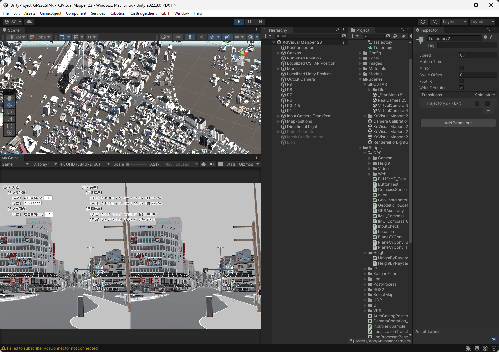

# 環境構築手順書

# 1 本書について

本書では、3D都市モデルをベースマップとしたPLATEAU VPSシステムの関連ツール、検証プログラムの利用環境構築手順について記載しています。本システムの構成や仕様の詳細については以下も参考にしてください。

[技術検証レポート](https://www.mlit.go.jp/plateau/file/libraries/doc/plateau_tech_doc_0018_ver01.pdf)

# 2 動作環境

本システムの動作環境は以下のとおりです。

| 項目 | 最小動作環境 | 推奨動作環境 | 
| - | - | - | 
| OS | Microsoft Windows 10 または 11 | 同左 | 
| CPU | Intel Core i7以上 | Intel Core i7以上 | 
| メモリ | 16GB以上 | 32GB以上 | 
| ディスプレイ解像度 | 1024×768以上 |  FullHD以上  | 
| ネットワーク       | 適切に設定されたローカルネットワーク |  同左                            | 

# 3 環境準備

## Unityのインストール

Unity Hubなどを利用してUnityをインストールします。

InitializerはUnity 2021.3.11f1、KdVisualMapperは2022.3.0f1で開発していますが、
近いバージョンであれば実行可能かと思われます。開く際に、バージョンの変更などを確認するダイアログが出ますが、進めます。
Initializerの方は、Androidビルドが可能なように、モジュールを追加します。

## モデルの準備

3D都市モデルからコンバートしてUnityで読めるようにしたモデルを準備します。
本実証では、変換用に用意した別プロジェクトで[PLATEAU SDK for Unity](https://github.com/Synesthesias/PLATEAU-SDK-for-Unity)を用いて読み込んだものをobj形式にエクスポートして利用しています。
公式チュートリアルなどを参考にして、必要なモデルを用意してください。

プロジェクト内では、モデルをAssets/App/Modelsに配置していますが、インポートする場所は任意の場所で構いません。管理しやすいようにしてください。

# 4 利用手順

## Initializer

1. Unityでプロジェクトを開きます

    Initializerフォルダを指定して、Unity Hubからプロジェクトを開きます。
    その際に、いくつか警告が出る可能性がありますが、進める選択肢を選択します。

2. Assets/App/Scenes/Real 102シーンを開きます

    ヒエラルキー内にある「Models」以下に、準備した3D都市モデルを配置します。
    このとき、対象とする地域などに応じて適切な位置に配置してください。
    基本的には、原点に置くことでうまくいくように、変換時に調整することをお勧めします。

    ROSConnector GameObjectのRosConnector Componentのアドレスを必要に応じて変更します。

    GPS GameObjectのPlan XY ConvのP0latとP0lonを必要に応じてモデル原点などに変更します。

3. ビルド

    プラットフォームをAndroidに変更してビルドします。
    Android端末をUSBケーブルで接続し、Build And Runをするなり、出力されたapkファイルをインストールなどして、端末にインストールしてください。

4. 実行

    Android端末上でアプリアイコンを押して実行します。
    マップ選択画面などを経て、以下のような画面になります。

    C*が動作しているPCとはWifiなどの通信方法で同じネットワーク内で動作するようにします。また、実行時にGPSやカメラのパーミッション設定を求められるので、許可します。
    画面で各種パラメータの調整や、現在値の確認などを行えます。

## KdVisualMapper

1. Unityでプロジェクトを開きます

    KdVisualMapperフォルダを指定して、Unity Hubからプロジェクトを開きます。
    その際に、いくつか警告が出る可能性がありますが、進める選択肢を選択します。

2. Assets/App/Scenes/KdVisual Mapper 23シーンを開きます。

    ヒエラルキー内にある「Models」以下に、準備した3D都市モデルを配置します。
    このとき、対象とする地域などに応じて適切な位置に配置してください。
    基本的には、原点に置くことでうまくいくように、変換時に調整することをお勧めします。

    ROSConnector GameObjectのRosConnector Componentのアドレスを必要に応じて変更します。
    
3. カメラのパスを指定する

    Input Camera Transform GemeObjectのAnimator Componentのアニメーションでカメラの動きを自動的に制御します。
    カメラのパスを変える場合はここを適切に変更してください。

4. 実行

    KdVisualMapperはEditorから実行することができます。Editorの再生ボタンを押して実行します。
    あらかじめ、KdVisualを別PCなどで動作させておきます。
    KdVisualのPCとKdVisualMapperのPCの間はネットワークの疎通が通るように設定します。
    KdVisualMapperを動作させるとKdVisualに随時設定したパスに沿ってレンダリングされた画像が送られ、VSLAMのマッピングが行われます。

